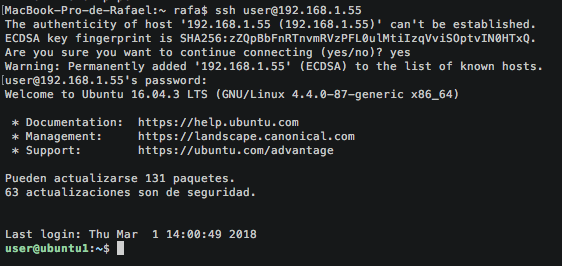

# Practica 1 - SWAP
##### Rafael Nogales Vaquero

## Instalación de las máquinas virtuales:
#### Paso 1 - Descargas:
  Descargamos [Virtual Box](https://www.virtualbox.org/wiki/Downloads) y creamos una máquina ubuntu server,
  para ello hay que [descargar la imagen de ubuntu](http://releases.ubuntu.com/16.04/)
  en mi caso me gusta descargar siempre las versiones LTS (soporte a largo plazo).
  Por eso aunque hay una versión de Ubuntu Server de 2017 no la he seleccionado.
#### Paso 2 - Creacion de las máquinas:
Abrimos Virtual Box y creamos una nueva máquina tipo Ubuntu y preparamos toda la
configuración.
En mi caso:
  - 2GB RAM
  - 1 core
  - Red en modo "Adaptador Puente"

Lo único importante es poner la red en modo "Adaptador puente"
De esta forma las máquinas virtuales (invitados en la imagen) están conectadas a tu red local pero tambien a internet.
Si elegimos "red interna" lo que estamos haciendo es crear una red privada virtual que no está conectada a internet.


Fig. 1 (Adaptador Puente)


#### Paso 3 - Configuración de SSH
Ahora queremos poder conectarnos a las máquinas desde el anfitrión o desde cualquier otra máquina.
Por ejemplo poder conectarnos a la máquina 1 desde la máquina 2.
Para ello utilizamos el servicio SSH (*Secure SHell*)

Lo instalamos en las máquinas virtuales con:
```
sudo apt-get install openssh-client
sudo apt-get install openssh-server
```

Aunque esto no hace falta vamos a crear una copia de seguridad del archivo original de configuración de ssh
y a dejarlo sin permiso de escritura para mayor seguridad:
```
sudo cp /etc/ssh/sshd_config /etc/ssh/sshd_config.original
sudo chmod a-w /etc/ssh/sshd_config.original
```

Ahora veamos cual es la dirección IP del servidor:
```
ifconfig
```


Nos conectamos a la máquina por SSH desde el anfitrión:

```
ssh username@IP_address
```


Como primera orden desde ssh podemos actualizar el sistema:

```
sudo apt-get update && sudo apt-get ugrade
```

#### Paso 4 - Instalar Apache2

Para instalar Apache basta con escribir en la terminal:

```
sudo apt -get install apache2
```

Podemos comprobar que se ha instalado correctamente preguntando por la versión con el comando:
```
apache2 -v
```
En mi caso tengo la versión 2.4, concretamente:
```
Server version: Apache/2.4.18 (Ubuntu)
Server built:   2017-09-18T15:09:02
```

Ahora que sabemos que está instalado vamos a configurarlo:

Lo primero que haremos es darle un nombre a nuestro servidor. Para ello podemos usar un dominio (si lo tenemos) o simplemente la dirección IP pública de nuestro servidor.

En un servidor conectado a internet la IP pública será algo del tipo: 121.23.212.74
pero en mi caso como lo estoy creando dentro de una red doméstica es algo del tipo 192.168.1.XXX
en concreto 192.168.1.55 (es decir es la máquina 55 de mi subred doméstica).  

Para darle nombre al servidor basta con ir a la última linea de */etc/apache2/apache2.conf*
y escribir lo siguiente:

```
# Server Name
ServerName 192.168.1.55
```
Para hacerlo abrimos un editor de texto plano y lo escribimos sin más, en mi caso voy a usar *nano*:
```
sudo nano /etc/apache2/apache2.conf
```
Para comprobar que todo va bien podemos usar:

```
sudo apache2ctl configtest
```

Y nos dirá "Syntax OK"

Siempre que hagamos cambios en el archivo *apache2.conf* deberemos reiniciar el servidor apache para que los cambios surtan efecto.

```
sudo systemctl restart apache2
```

La prueba definitiva para ver si hemos conseguido instalar correctamente apache es abrir la página por defecto.  
Para ello vamos a nuestro navegador y escribimos la dirección IP pública del servidor apache (o el dominio\*) y debería aparecer la siguiente web:


\*Nota: Si lo que escribimos es el dominio tal vez haya que esperar unos minutos si acabamos de comprarlo ya que hay que esperar a que se propague el DNS.

**Nota:**   
Si has tenido algún problema...  
Para ver si apache está arrancado podemos utilizar el siguiente comando:
```
ps aux | grep apache
```
Esto es útil si aún no hemos conseguido ver nada y no sabemos si apache está o no arrancado.
### Paso 5 Instalar MySQL

MySQL es el sistema gestor de bases de datos que va a utilizar nuestro servidor.  
Para un sistema más complejo podríamos instalarlo en una máquina a parte pero aquí vamos a tener el servidor de bases de datos (MySQL) en la misma máquina que el servidor web (Apache).  

Para instala MySQL basta con utilizar el comando linux:

```
sudo apt-get install mysql-server mysql-client
```

*En caso de tener la base de datos en una máquina diferente solo necesitaríamos el* mysql-client *ya que el servidor estaría en otra parte.*

**importante:** En toda instalación MySQL viene una base de datos de ejemplo así como un usuario de ejemplo.  
Es muy importante eliminarlos (por razones de seguridad) si vamos a usar esta instalación en un entorno de producción

Para realizar la instalación segura ejecutamos el comando

```
mysql_secure_installation
```
Nos pedirá la contraseña del usuario root y nos preguntará acerca de algunos parámetros de seguridad.  
En mi caso voy a realizar las siguientes medidas:
+ Eliminar los usuarios anonimos
+ Evitar conectarse al usuario root desde otra máquina (solo le se permite conectarse desde localhost)
+ Eliminar la base de datos de ejemplo
+ Actualizar los permisos de todas las tablas

Para comprobar que nuestra base de datos está operativa ejecutamos:

```
mysql -u root -p
```
Nos pedirá la contraseña del usuario root de mysql que hemos creado antes y nos abrirá la terminal de la base de datos.

```
Welcome to the MySQL monitor.  Commands end with ; or \g.
Your MySQL connection id is 5
Server version: 5.7.21-0ubuntu0.16.04.1 (Ubuntu)

Copyright (c) 2000, 2018, Oracle and/or its affiliates. All rights reserved.

Oracle is a registered trademark of Oracle Corporation and/or its
affiliates. Other names may be trademarks of their respective
owners.

Type 'help;' or '\h' for help. Type '\c' to clear the current input statement.

mysql>
```

Para cerrarla escribimos la sentencia SQL de salida:
```
exit;
```


### Paso 6 Instalar PHP

En nuestro caso vamos a instalar la versión 7 de PHP porque es la versión estable más actual en este momento y porque es más eficiente que PHP 5.  
Para que apache pueda utilizar PHP hay que instalar la librería correspondiente y reiniciar el servidor para que surta efecto.
```
sudo apt-get -y install php7.0 libapache2-mod-php7.0
```

Ahora reiniciamos apache:
```
systemctl restart apache2
```

Para comprobar que todo ha funcionado creamos una pequeña web dinámica con PHP, para ello basta con escribir un pequeño script PHP en la carpeta html por defecto del servidor: "/var/www/html"

Para ello basta con usar la siguiente orden

```
sudo nano /var/www/html/info.php
```

y escribir el siguiente script:

```
<?php
phpinfo();
?>
```

Sólo falta darle permiso a apache para leer el archivo:
```
sudo chown www-data:www-data /var/www/html/info.php
```

Y podemos ir al navegador y acceder a la ruta correspondiente, en mi caso:
```
http://192.168.1.55/info.php
```
Lo cual muestra una web con carácteristicas de nuestra versión de PHP y nuestro servidor.  
En mi caso:  

