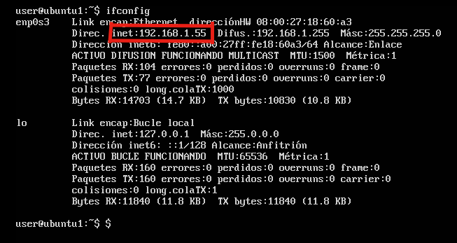

# Practica 1 - SWAP
##### Rafael Nogales Vaquero

## Instalación de las máquinas virtuales:
#### Paso 1 - Descargas:
  Descargamos [Virtual Box](https://www.virtualbox.org/wiki/Downloads) y creamos una máquina ubuntu server,
  para ello hay que [descargar la imagen de ubuntu](http://releases.ubuntu.com/16.04/)
  en mi caso me gusta descargar siempre las versiones LTS (soporte a largo plazo).
  Por eso aunque hay una versión de Ubuntu Server de 2017 no la he seleccionado.
#### Paso 2 - Creacion de las máquinas:
Abrimos Virtual Box y creamos una nueva máquina tipo Ubuntu y preparamos toda la
configuración.
En mi caso:
  - 2GB RAM
  - 1 core
  - Red en modo "Adaptador Puente"

Lo único importante es poner la red en modo "Adaptador puente"
De esta forma las máquinas virtuales (invitados en la imagen) están conectadas a tu red local pero tambien a internet.
Si elegimos "red interna" lo que estamos haciendo es crear una red privada virtual que no está conectada a internet.


Fig. 1 (Adaptador Puente)


#### Paso 3 - Configuración de SSH
Ahora queremos poder conectarnos a las máquinas desde el anfitrión o desde cualquier otra máquina.
Por ejemplo poder conectarnos a la máquina 1 desde la máquina 2.
Para ello utilizamos el servicio SSH (*Secure SHell*)

Lo instalamos en las máquinas virtuales con:
```
sudo apt-get install openssh-client
sudo apt-get install openssh-server
```

Aunque esto no hace falta vamos a crear una copia de seguridad del archivo original de configuración de ssh
y a dejarlo sin permiso de escritura para mayor seguridad:
```
sudo cp /etc/ssh/sshd_config /etc/ssh/sshd_config.original
sudo chmod a-w /etc/ssh/sshd_config.original
```

Ahora veamos cual es la dirección IP del servidor:
```
ifconfig
```



Nos conectamos a la máquina por SSH desde el anfitrión:

```
ssh username@IP_address
```


Como primera orden desde ssh podemos actualizar el sistema:

```
sudo apt-get update && sudo apt-get ugrade
```

#### Paso 3 - Instalar Apache2
