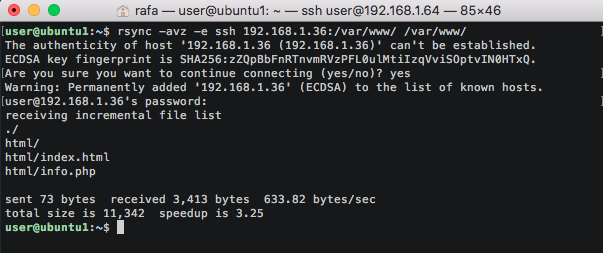
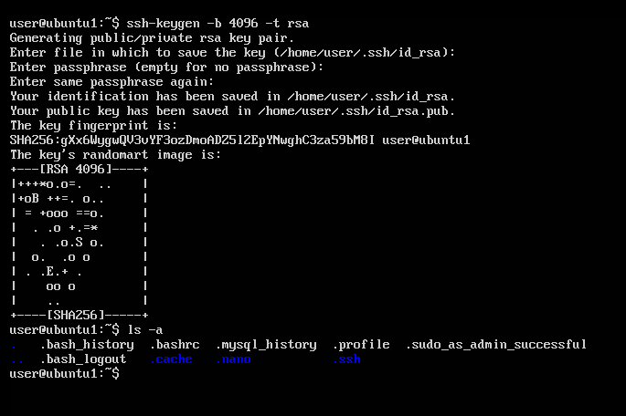
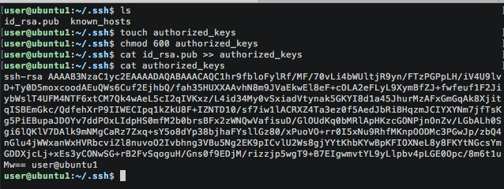

# Practica 2 - SWAP
##### Rafael Nogales Vaquero

## Sincronizando las máquinas de la granja web:
#### Introducción:
  El objetivo de esta práctica es hacer que las máquinas de nuestra granja tengan
  la misma información en su carpeta pública */var/www/* para ello vamos a utilizar
  la herramienta **rsync**.  
  Podríamos pensar en utilizar otras alternativas más sencillas, por ejemplo,
  comprimir la carpeta que queremos enviar y enviarla mediante un pipe y ssh a la
  maquina de destino:
  ```
  tar czf - directorio | ssh equipodestino 'cat > ~/tar.tgz'
  ```
  Pero esto no es muy práctico en general y es mejor utilizar la herramienta **rsync**.

#### Entorno:

Para esta guía vamos a tener dos máquinas Ubuntu 16.04 con las siguientes carácterisiticas:

###### M1:
- IP: 192.168.1.36
- Username: user

###### M2:
- IP: 192.168.1.64
- Username: user


#### Paso 1: Instalar la herramienta rsync:

En este caso vamos a utilizarlo en máquinas Linux, concretamente Ubuntu 16.04.  
En estas máquinas viene instalado por defecto, pero nunca está de más comprobarlo:
```
sudo apt-get install rsync
```
En la mayoría de sistemas Unix viene instalado por defecto, pero si queremos instalarlo
y no tenemos un sistema basado en Debian o en BSD debemos descargarlo desde la web oficial:  
[rsinc download](http://rsync.samba.org/download.html)


#### Paso 2 - Sincronización de /var/www

En este momento podemos decidir entre trabajar con el usuario *root* o con
nuestro usuario habitual, en este caso el usuario se llama *user*.  
Para hacer que *user* sea el nuevo dueño de la carpeta */var/www* ejecutamos:
```
sudo chown user:user –R /var/www
```
Para clonar la carpeta /var/www de la máquina M1 a la máquina M2 hacemos nos vamos a la máquina M2 y ejecutamos:

```
rsync -avz -e ssh ipmaquinaM1:/var/www/ /var/www/
```

Nos debe quedar algo así:  



*Nota:* Cabe destacar que cuando utilizamos rsync la carpeta en el destino es una copia identica de la carpeta origina, es decir mantiene los permisos de los usuarios y las fechas de modificación y creación de la máquina original.

##### Ampliación:

La herramienta rsync nos permite especificar qué directorios copiar y cuáles ignorar en
el proceso de copia, de forma que no se sobreescriban los archivos que no queramos.  
Así, si hacemos:  
```
rsync -avz --delete --exclude=**/stats --exclude=**/error -- exclude=**/files/pictures -e ssh maquina1:/var/www/ /var/www/
```

estaremos haciendo la copia completa del directorio */var/www* pero excluyendo */var/www/error*, */var/www/stats* y */var/www/files/pictures*

La opción --delete indica que aquellos ficheros que se hayan eliminado en la máquina origen, también se borren en la máquina destino (para que el clonado sea perfecto). La opción --exclude indica que ciertos directorios o ficheros no deben copiarse (p.ej., archivos de log). De esta forma, en la orden de ejemplo anterior, cuando indicamos _-- exclude=\*\*/error_ significa "no copies lo que hay en */var/www/error*" ya que corresponde a mensajes de la máquina original (y la segunda máquina ya generará sus propios mensajes).

Autor de la ampliación: *Pedro Ángel Castillo Valdivieso - UGR*

#### Paso 3 - Configurar acceso mediante SSH sin contraseña

Lo que hemos hecho está muy bien pero tiene un gran problema:  
El problema de comando anterior es que necesitamos acceder por ssh a la máquina desde la que vamos a copiar, y **por defecto necesita que el administrador esté pendiente de teclear las contraseñas**, por tanto no podemos automatizarlo totalmente hasta que eliminemos ese paso del tecleo de la contraseña.  
Para ello vamos a configurar un sistema de autenticación mediante clave publica-privada.

En concreto vamos a usar un cifrado rsa de 4096 bits, un cifrado de 4096 bits puede considerarse muy seguro en cuanto a la dificultad de factorización del mismo, pero no por tener ese tipo de cifrado podemos estar tranquilos aunque nos aseguramos de que romper el cifrado mediante "fuerza bruta" va a ser inviable en bastante tiempo.

En la máquina secundaria escribimos:
```
ssh-keygen -b 4096 -t rsa
```
Nos pedirá una serie de opciones, en mi caso lo he dejado todo en blanco (por defecto):



**rsa**: Generará, por defecto, el fichero *~/.ssh/id_rsa* para la clave privada y el fichero *~/.ssh/id_rsa.pub* para la clave pública. Este formato es válido para el protocolo 2 de SSH

Ahora copiamos la clave pública a la máquina principal, hay dos formas de hacerlo:
##### Versión 1 (manual y pedagógica):
```
scp ~/.ssh/id_rsa.pub 192.168.1.36:/home/user/.ssh
```

Ahora vamos a la máquina principal y hacemos esto:

```
touch authorized_keys
chmod 600 authorized_keys
cat id_rsa.pub >> authorized_keys
rm id_rsa.pub
```



##### Versión 2 (rápida y elegante):
En la máquina secundaria (en la que hemos generado las claves) escribimos:

```
ssh-copy-id IP_maquina1
```
Nos pedirá la contraseña y en caso de que aun no esté instalada la clave publica en la maquina1 este comando lo creará exactamente igual que hemos hecho antes (pero sin tener que hacerlo a mano).


Para comprobar que podemos conectarnos a la máquina principal desde la máquina secundaria nos vamos a la secundaria y escribimos:
```
ssh IP_maquina1
```
Y esta vez no pedirá ninguna contraseña.

*Nota*: Si intentamos conectarnos desde la máquina1 a la maquina2 esto no nos va a funcionar.
Habría que volver a copiar claves pero esta vez en el otro sentido.

#### Paso 4 Programar tareas con crontab:

*cron* es un administrador procesos en segundo plano que ejecuta procesos en el instante indicado en el fichero crontab.  
cron se ejecuta en background y revisa cada minuto la tabla del fichero */etc/crontab* en búsqueda de tareas que se deban ejecutar (si ha llegado su momento). Podemos agregar nuevas tareas a cron para automatizar algunos procesos (p.ej. copias de seguridad).  
Para ello, debemos editar el archivo */etc/crontab* que normalmente tendrá un aspecto similar al siguiente:

```
# /etc/crontab: system-wide crontab
# Unlike any other crontab you don't have to run the `crontab'
# command to install the new version when you edit this file
# and files in /etc/cron.d. These files also have username fields,
# that none of the other crontabs do.

SHELL=/bin/sh
PATH=/usr/local/sbin:/usr/local/bin:/sbin:/bin:/usr/sbin:/usr/bin

# m h dom mon dow user	command
17 *	* * *	root    cd / && run-parts --report /etc/cron.hourly
25 6	* * *	root	test -x /usr/sbin/anacron || ( cd / && run-parts --report /etc/cron.daily )
47 6	* * 7	root	test -x /usr/sbin/anacron || ( cd / && run-parts --report /etc/cron.weekly )
52 6	1 * *	root	test -x /usr/sbin/anacron || ( cd / && run-parts --report /etc/cron.monthly )
#
```
Las abreviaturas son las siguientes:
+ m -> minuto
+ h -> hora
+ dom -> Day of Month (dia del mes)
+ dow -> Day of week (dia de la semana: 7=Domingo)
+ user -> Usuario que ejecutará el comando
+ command -> Comando que será ejecutado

###### Ejemplo:
La siguiente tarea eliminará todos los archivos de la carpeta */tmp* todos los martes (día 2) a las 04:30h:  
```
30 4 * * 2 root rm /tmp/*
```

La siguiente tarea mantendrá actualizado el contenido del directorio */var/www* entre las dos máquinas cada hora (en punto):
```
0 * * * * root rsync -avz -e ssh 192.168.1.36:/var/www/ /var/www/
```
