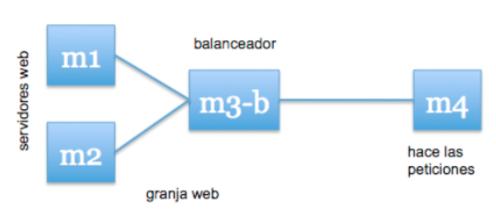
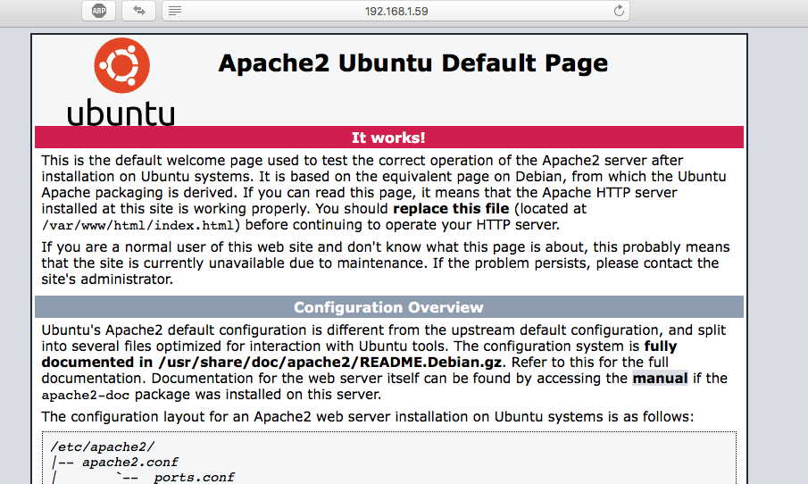

# Practica 3 - SWAP
##### Rafael Nogales Vaquero

## Balanceo de Carga
#### Introducción:
En esta práctica configuraremos una red entre varias máquinas de forma que tengamos un balanceador que reparta la carga entre varios servidores finales.  
El problema a solucionar es la sobrecarga de los servidores. Se puede balancear cualquier protocolo, pero dado que esta asignatura se centra en las tecnologías web, balancearemos los servidores HTTP que tenemos configurados.  
De esta forma conseguiremos una infraestructura redundante y de alta disponibilidad.  

*Se podría considerar una solución basada en balanceo por DNS pero tiene el problema de que si una máquina muere el servidor DNS no puede enterarse de esto y seguirá redirigiendo tráfico hacia la máquina muerta, por tanto una parte de los usuarios verían nuestra página caida hasta que caduque la caché del navegador del usuario (o hasta que la borre, pero eso no es una solución aceptable ni conseguiremos alta disponibilidad).*

El primer paso "Paso 0" es instalar una nueva máquina *Balancador* a nuestro entorno.  
Esta máquina en mi caso es otro Ubuntu 16.04 al que le hemos configurado un servidor ssh para poder controlarla desde remoto y sin ningún otro añadido.  
Durante la práctica vamos a probar dos configuraciones distintas para esta máquina:
 + Opción 1: Usar NGINX
 + Opción 2: Usar HAProxy   

#### Entorno:

Para esta guía vamos a tener tres máquinas Ubuntu 16.04 con las siguientes carácterisiticas:

###### M1:
- IP: 192.168.1.36
- Username: user
- LAMP server

###### M2:
- IP: 192.168.1.64
- Username: user
- LAMP server

###### Balanceador:
- IP: 192.169.1.59
- Username: user

###### M4:
- IP: 192.169.1.XXX
- Sistema Operativo: Irrelevante (OS X en mi caso)
- Otra máquina en la red (en mi caso el anfitrión)




### Opción 1: Usar NGINX como balanceador de carga:

#### Acerca de NGINX:
*nginx* (pronunciado en inglés “engine X”) es un servidor web ligero de alto rendimiento. Lo usan muchos sitios web conocidos, como: WordPress, Hulu, GitHub, Ohloh, SourceForge, TorrentReactor y partes de Facebook. Su página principal (en español) es http://wiki.nginx.org/NginxEs  

Debido a su buen rendimiento, también se usa como servidor web en lugar del Apache o IIS, aunque uno de los usos más extendidos es como balanceador de carga en un cluster web. De esta forma, el servidor con la IP pública (de cara a Internet) ejecuta el nginx, que se ocupa de redirigir el tráfico a los servidores finales.  
Estos servidores finales pueden servir su contenido web con cualquier servidor, no necesariamente deben ser nginx tambien.

**Nota:** *nginx* es especialmente bueno cuando se trata de servir contenido estático.

#### Paso 1: Instalación de nginx

##### Actualización inicial
Como siempre que trabajamos en una máquina recién instalada conviene actualizar sus paquetes, para ello podemos usar esta orden resumida:
```
sudo apt-get update && sudo apt-get dist-upgrade && sudo apt-get autoremove
```

O bien hacer el típico:
```
sudo apt-get update
sudo apt-get upgrade
```
##### Instalar nginx:
Para instalar *nginx* de nuevo usamos el típico apt-get:
```
sudo apt-get install nginx
```
nginx es un servidor muy ligero por lo que la duración de la instalación será especialmente corta.  

Para arrancar nginx utilizamos el gestor de demonios del sistema:  
```
sudo systemctl start nginx
```

##### Comprobaciones:
Para comprobar que está funcionando podemos usar systemctl de nuevo:
```
systemctl | grep "nginx"
```
Y nos debe aparecer algo de este estilo:
```
  loaded active running  <Descripción de nginx>
```

Ampliación: [Más opciones de systemctl](https://wiki.archlinux.org/index.php/systemd_(Español)

##### Cortafuegos
Por defecto Ubuntu al instalar un servidor web lo añade a la lista blanca del cortafuegos, puedes verificarlo con el comando ufw:
```
sudo ufw app list
```

En mi caso el cortafuegos tiene las siguientes reglas:
```
Available applications:
  Nginx Full
  Nginx HTTP
  Nginx HTTPS
  OpenSSH
```
Si Nginx no apareciese en la lista del cortafuegos o si tuviesemos algún otro problema podemos consultar [la guía de instalación detallada de nginx](https://www.liberiangeek.net/2016/07/how-to-install-nginx-webserver-on-ubuntu-16-04/)

#### Paso 2: Configurar nginx como balanceador de carga
nginx soporta la realización de balanceo de carga mediante la directiva *proxy_pass*. En nuestro caso nos interesa redirigir el tráfico a un grupo de servidores. Para definir este grupo deberemos dar un nombre al conjunto mediante la directiva *upstream*.  
Para aclarar las cosas vamos a ir directamente al fichero de configuración de nginx */etc/nginx/conf.d/default.conf* y empezar a tocar.  
Lo normal en una máquina recien instalada es que este fichero no exista por lo que lo creamos con:
```
sudo touch /etc/nginx/conf.d/default.conf
```
Si el fichero existía debemos crear una copia de seguridad del mismo y crear uno nuevo con el mismo nombre borrando todo su contenido:
```
sudo cp /etc/nginx/conf.d/default.conf /etc/nginx/conf.d/default.conf.backup
sudo rm /etc/nginx/conf.d/default.conf
sudo touch /etc/nginx/conf.d/default.conf
```
Ahora que tenemos el archivo limpio vamos a configurar nginx como balanceador de carga, para ello vamos a ir configurando las directivas en el fichero poco a poco y explicando su uso:
##### upstream:
La directiva *upstream* se utiliza para crear grupos de servidores entre los que balancear el tráfico, en nuestro caso vamos a crear un grupo de servidores web, que como son Apache2 vamosa a llamar *apaches*, para ello añadimos el siguiente bloque al archivo de configuración:
```
upstream apaches {
    server 192.168.1.36;
    server 192.168.1.64;
}
```
*Notas:*
+ Además de la IP también se pueden usar los nombres de dominio.
+ Es muy recomendable colocar la directiva upstream al principio del archivo para que el resto de directivas puedan referenciar el cluster.

##### server:
La directiva *server* se utiliza para definir el comportamiento de nginx como servidor. En este caso se está configurando como proxy entre internet y los servidores apaches.  
Y lo que hace es redirigir el tráfico del puerto 80 hacia el cluster "apaches" que hemos definido con upstream.  
Además es importante que se use *http versión 1.1* y borrar la cabecera Connection para que el servidor final no la vea.


```
server{
    listen 80;
    server_name balanceador;
    access_log /var/log/nginx/balanceador.access.log;
    error_log /var/log/nginx/balanceador.error.log;
    root /var/www/;

    location / {
        proxy_pass http://apaches;
        proxy_set_header Host $host;
        proxy_set_header X-Real-IP $remote_addr;
        proxy_set_header X-Forwarded-For $proxy_add_x_forwarded_for;
        proxy_http_version 1.1;
        proxy_set_header Connection "";
    }
}
```
Esto es una configuración muy estandard que usa balanceo round-robin.  
Para ampliar sobre el funcionamiento de nginx se recomienda ir a la [guía oficial en español.](http://nginx.org/en/docs/http/load_balancing.html)

##### Desactivar sites:
Por defecto nginx viene configurado como servidor web, por lo que debemos desactivar los sitios desde los que sirve contenido por defecto, para que lo primero que encuentre sean nuestras máquinas apaches en lugar de su web por defecto.  
Para ello hay que ir al archivo /etc/nginx/nginx.conf y borrar o comentar la ultima linea del bloque http:
```
include /etc/nginx/sites-enabled/*;
```
*Nota:* Para comentarla basta con añadir *#* delante.

En este punto podemos relanzar el servidor nginx:
```
sudo systemctl reload nginx
```
Y probar a acceder desde el navegador (o con curl) a la IP del balanceador y ver que aparece una página de apache:



Para estar seguros de cómo se está balanceando la carga podemos crear una nueva página HTML en los apaches.  
Para ello vamos al directorio */var/www/html* de cada apache y creamos un archivo llamado *name.html*

Con el siguiente contenido:
```
<!DOCTYPE html>
<html lang="en">
<head>
  <meta charset="UTF-8">
  <meta name="viewport" content="width=device-width, initial-scale=1.0">
  <meta http-equiv="X-UA-Compatible" content="ie=edge">
  <title>Name</title>
</head>
<body>
  <p>Soy la máquina 1</p>
</body>
</html>
```
En la máquina2 lógicamente debe decir: "Soy la máquina 2"

*Advertencia:*  
Hay que tener en cuenta que si las máquinas tiene algún proceso de sincronización cuando el cron active el proceso de sincronización ambas máquinas pondrán el mismo nombre porque tendrán una copia idéntica de name.html.  
Para evitarlo vamos a modificar la tarea cron:  
_-- exclude=**/html/name.html_
```
0 * * * * root rsync -avz --delete  --exclude=**/html/name.html -e ssh 192.168$

```

#### Paso 3: Configuración ampliada de NGINX:
##### Mantener sesiones:
Esta configuración es muy útil, pero aún así nos interesará que todas las peticiones que vengan de la misma IP se dirijan a la misma máquina servidora final. Esto es así porque si el usuario está usando una aplicación web que mantiene algún tipo de estado durante la navegación, y el balanceador lo cambia a otra máquina servidora final, puede que reciba algún error.  
Para evitarlo, podemos hacer un balanceo por IP, de forma que todo el tráfico que venga de una IP se sirva durante toda la sesión por el mismo servidor final. Para ello, como hemos indicado antes, usaremos la directiva *ip_hash* al definir el upstream:

```
upstream apaches {
    ip_hash;
    server 192.168.1.36 weight=1;
    server 192.168.1.64 weight=1;
}
```
Aquí además hemos anotado explicitamente que ambas máquinas deben recibir el mismo peso ya que las máquinas tienen la misma potencia.

Hay formas mejores de conseguir la persistencia de sesión pero no están disponibles en la versión gratuita de NGINX.

Podemos ver más opciones de configuración de nginx [en esta guía](https://futurestud.io/tutorials/nginx-load-balancing-advanced-configuration).


### Usar HAProxy como balanceador de carga:
#### Paso 1:
