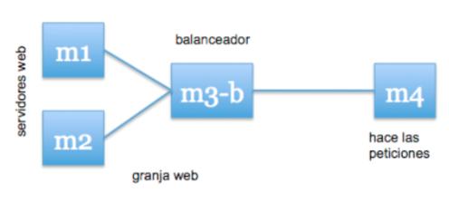
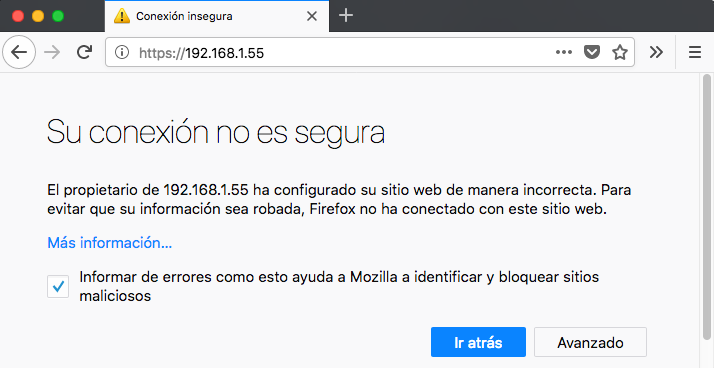
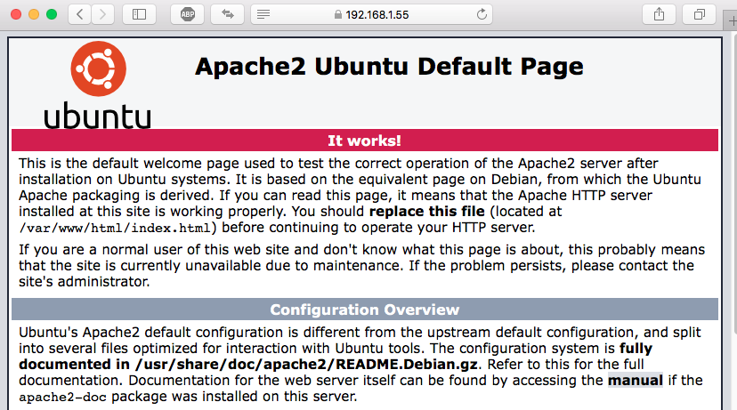

# Practica 4 - SWAP
##### Rafael Nogales Vaquero

## Seguridad en servidores web
#### Introducción:
En esta práctica llevaremos a cabo la configuración de seguridad de la granja web. Para ello, llevaremos a cabo las siguientes tareas:
* Instalar un certificado SSL para configurar el acceso HTTPS a los servidores.
* Configurar las reglas del cortafuegos para proteger la granja web.

#### Entorno:

Para esta guía vamos a tener tres máquinas Ubuntu 16.04 con las siguientes carácterisiticas:

###### M1:
- IP: 192.168.1.56
- Username: user
- LAMP server

###### M2:
- IP: 192.168.1.55
- Username: user
- LAMP server

###### Balanceador:
- IP: 192.169.1.59
- Username: user

###### M4:
- IP: 192.169.1.XXX
- Sistema Operativo: Irrelevante (OS X en mi caso)
- Otra máquina en la red (en mi caso el anfitrión)




### Instalar certificado SSL para acceder mediante HTTPS a nuestra granja

Un certificado SSL sirve para brindar seguridad al visitante de su página web, una manera de decirles a sus clientes que el sitio es auténtico, real y confiable para ingresar datos personales.
El protocolo SSL (Secure Sockets Layer) es un protocolo de comunicación que se ubica en la pila de protocolos sobre TCP/IP. SSL proporciona servicios de comunicación segura entre cliente y servidor, como por ejemplo autenticación (usando certificados), integridad (mediante firmas digitales), y privacidad (mediante encriptación).  
La versión actual es la SSLv3, que se considera insegura. El nuevo estándar se llama TLS (Transport Layer Security).  
Existen diversas formas de obtener un certificado SSL e instalarlo en nuestro servidor web para poder servir páginas mediante el protocolo HTTPS, para ello, lo principal es conseguir un certificado que podremos conseguir de las siguientes formas:  

1.  Mediante una autoridad de certificación.  
2. Crear nuestros propios certificados SSL auto-firmados usando la herramienta  
openssl.  
3. Utilizar certificados del proyecto Certbot (antes Let’s Encrypt).  

#### Generar e instalar un certificado autofirmado

Para generar un certificado SSL autofirmado en Ubuntu Server solo debemos activar el módulo SSL de Apache, generar los certificados y especificarle la ruta a los certificados en la configuración. Así pues, como root ejecutaremos:
```
a2enmod ssl
service apache2 restart
mkdir /etc/apache2/ssl
cd /etc/apache2/ssl
openssl req -x509 -nodes -days 365 -newkey rsa:2048 -keyout apache.key -out apache.crt
```

Editamos el archivo de configuración del sitio default-ssl:
```
nano /etc/apache2/sites-available/default-ssl.conf
```
Y agregamos estas lineas debajo de donde pone SSLEngine on:
```
SSLCertificateFile /etc/apache2/ssl/apache.crt SSLCertificateKeyFile /etc/apache2/ssl/apache.key
```
Activamos el sitio default--ssl y reiniciamos apache:
```
a2ensite default-ssl
service apache2 reload
```

Una vez reiniciado Apache, accedemos al servidor web mediante el protocolo HTTPS y veremos, si estamos accediendo con un navegador web, que en la barra de dirección sale en rojo el https, ya que se trata de un certificado autofirmado.  

Al entrar a la web nos aparecerá un mensaje avisando de que la web no es segura:  
En Firefox es algo así:


Una vez confirmamos la excepción de seguridad podemos ver la web aunque dependiendo del navegador aparecerá como segura o parcialmente segura:  

En Firefox el candado aparece con una señal de alerta:


En Safari una vez confirmas la excepción de seguridad entiende que sabe lo que haces y la muestra como una web segura (en mi opinión es mejor lo que hace Firefox)


También podemos comprobar que funciona utilizando curl:
```
curl -k https://192.168.1.55/
```

Para copiar los certificados de una máquina a otra podemos ir a la otra máquina y ejecutar:
```
sudo a2enmod ssl
sudo rsync -avz -e ssh user@192.168.1.55:/etc/apache2/ssl /etc/apache2/
sudo rsync -avz --delete -e ssh user@192.168.1.55:/etc/apache2/sites-available/default-ssl.conf /etc/apache2/sites-available/default-ssl.conf
a2ensite default-ssl
service apache2 reload
service apache2 restart
```

### Configuración del cortafuegos
Un cortafuegos es un componente esencial que protege la granja web de accesos indebidos. Son dispositivos colocados entre subredes para realizar diferentes tareas de manejo de paquetes. Actúa como el guardián de la puerta al sistema web, permitiendo el tráfico autorizado y denegando el resto.  
En general, todos los paquetes TCP/IP que entren o salgan de la granja web deben pasar por el cortafuegos, que debe examinar y bloquear aquellos que no cumplan los criterios de seguridad establecidos. Estos criterios se configuran mediante un conjunto de reglas, usadas para bloquear puertos específicos, rangos de puertos, direcciones IP, rangos de IP, tráfico TCP o tráfico UDP.

##### Configuración del cortafuegos iptables en Linux

iptables es una herramienta de cortafuegos, de espacio de usuario, con la que el superusuario define reglas de filtrado de paquetes, de traducción de direcciones de red, y mantiene registros de log. Esta herramienta está construida sobre Netfilter, una parte del núcleo Linux que permite interceptar y manipular paquetes de red.  

Se basa en establecer una lista de reglas con las que definir qué acciones hacer con cada paquete en función de la información que incluye. La sintaxis del comando iptables está documentada en su página de manual (teclear el comando "man iptables" en el shell), aunque también se pueden encontrar multitud de tutoriales y páginas de ayuda en Internet.  

Para configurar adecuadamente iptables en una máquina Linux, conviene establecer como reglas por defecto la denegación de todo el tráfico, salvo el que permitamos después explícitamente. Una vez hecho esto, a continuación definiremos nuevas reglas para permitir el tráfico solamente en ciertos sentidos necesarios, ya sea de entrada o de salida. Por último, definiremos rangos de direcciones IP a los cuales aplicar diversas reglas, y mantendremos registros (logs) del tráfico no permitido y de intentos de acceso para estudiar más tarde posibles ataques.

##### Uso de la aplicación iptables
A continuación mostraremos cómo utilizar la herramienta para establecer ciertas reglas y filtrar algunos tipos de tráfico, o bien controlar el acceso a ciertas páginas:

Toda a información sobre la herramienta está disponible en su página de manual y usando la opción de ayuda:

```
man iptables
iptables –h
```

Para comprobar el estado del cortafuegos, debemos ejecutar:
```
iptables –L –n -v
```
Para lanzar, reiniciar o parar el cortafuegos, y para salvar las reglas establecidas hasta ese momento, ejecutaremos respectivamente:  
```
service iptables start
service iptables restart
service iptables stop
service iptables save
```


| Balanceador | Peticiones | Duracion del test | Peticiones/s | Tiempo por peticion |
| -----------| ------------| ------------------| ---------| ---------|
| HAProxy    | 6000        |  11.73 [s]        |   511.33 [#/s] | 97.784 [ms] |
| NGINX      | 6000        |  12.474 [s]       |   480 [#/s]    | 103.951 [ms]
