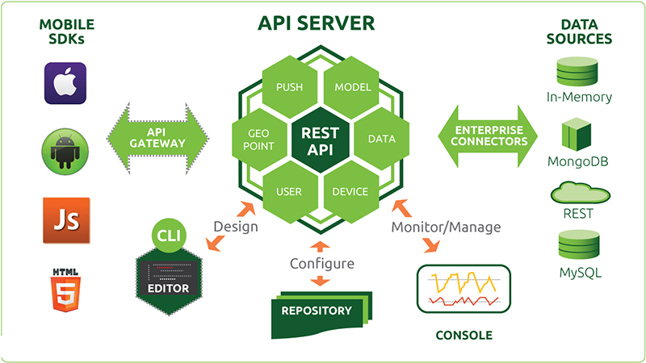
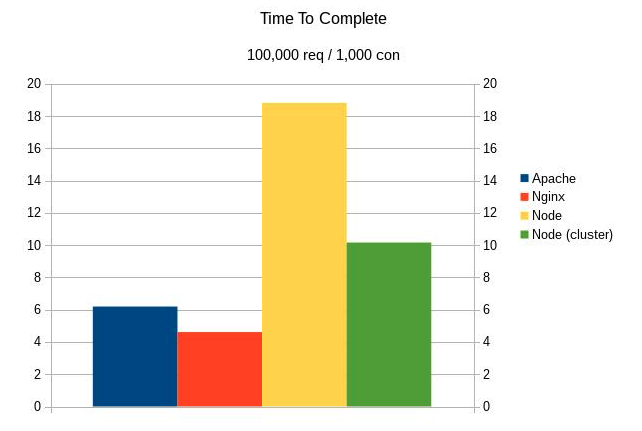
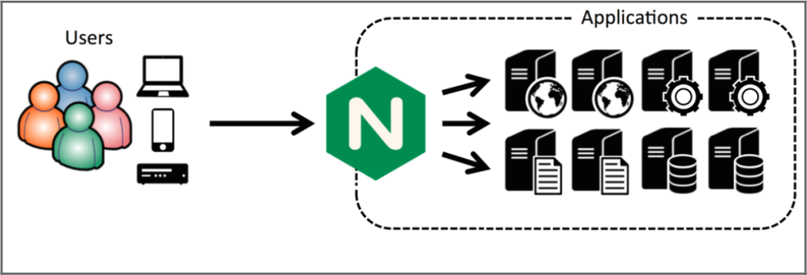

Sistemas Node.js Escalables
============================

### Rafael Nogales
### UGR - SWAP

---
# Introducción:

---

---
# Client side rendering (CSR)
* SPA
* Hosting barato
* Uso de CDN
* Despliegues fáciles
* Obliga a separar lógica e interfaz
* Misma UI para Web, móviles, and Escritorio.

---
# Server side rendering (SSR)

* Mejor rendimiento del SEO 
* Mejoras de prestaciones **para nuestros usuarios**

---
# Principales usos de Node.js

---
# Problemas de Node.js

* Node es lento sirviendo archivos estáticos
* Node usa un solo núcleo de nuestra máquina

---
# Soluciones
* Balanceo de carga
* Servir contenido estático desde NGINX

---

---

# Sources:

https://medium.com/walmartlabs/the-benefits-of-server-side-rendering-over-client-side-rendering-5d07ff2cefe8

https://medium.freecodecamp.org/heres-why-client-side-rendering-won-46a349fadb52

https://belitsoft.com/nodejs-development-services

https://www.stevesouders.com/blog/2012/02/10/the-performance-golden-rule/

https://iwf1.com/apache-vs-nginx-vs-node-js-and-what-it-means-about-the-performance-of-wordpress-vs-ghost