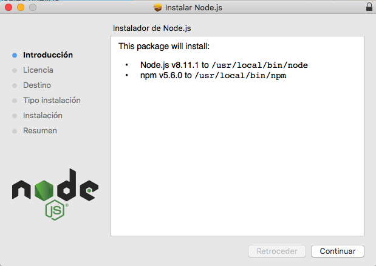
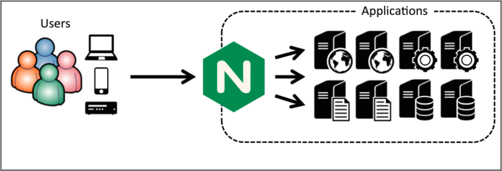

# Capítulo 1: Introducción

Las aplicaciones web actualmente están basadas en la arquitectura cliente-servidor.  
Por ello aparecen dos mundos dentro de la programación web:  
El mundo del cliente, *frontend*, y el mundo del servidor, *backend*.  
Node aunque pertenece a este segundo mundo utiliza JavaScript como lenguaje base.  
Esto hace que podamos programar tanto el frontend como el backend de nuestra aplicación utilizando un solo lenguaje principal.  

Actualmente existe una tendencia a ejecutar la mayor parte posible de las aplicaciones en el lado del cliente y utilizar el servidor tan solo para almacenar información de forma segura, comprobar que las peticiones se hayan hecho correctamente y no hayan sido modificadas maliciosamente.

Esto es así básicamente porque mejora la escalabilidad de tu aplicación y porque ahorras costes de infraestructura, ya que al aumentar el número de clientes tambien aumenta tu capacidad de procesamiento, al ser los propios clientes los que se encarguen de realizar la mayor parte del trabajo, sin coste alguno para nuestro sistema. Casualmente, Node.js es un potente aliado si optamos por esta nueva tendencia en lugar del anterior modelo que relizaba todo el trabajo en el lado del servidor y luego entregaba el resultado al cliente en forma de HTML completo.

## Qué es Node.js
Node.js es un entorno de tiempo de ejecución multiplataforma de código abierto utilizado para el desarrollo de aplicaciones web en el lado del servidor.  

Node se basa en una **arquitectura impulsada por eventos** y una **API de entrada/salida no bloqueante**.  
Esto quiere decir que cuando un cliente se conecta al servidor y hace una operacion de entrada/salida, el servidor no se queda bloqueado hasta que el cliente acabe, sino que puede seguir atendiendo más peticiones mientras la operación anterior se realiza en segundo plano. Lo cual aumenta el rendimineto y la escalabilidad en **aplicaciones web de tiempo real.**  
Además a diferencia de lo que ocurre en la arquitectura cliente-servidor clásica, con Node tanto el cliente como el servidor pueden iniciar la comunicación, lo cual lo hace extremadamente útil cuando se trata de desarrollar un backend para una aplicación móvil o una API que será consumida desde internet.

Además, Node forma parte fundamental en el stack MEAN
(Mongo-Express-Angular-Node) basado en JavaScript, que es la alternativa moderna al clásico LAMP (Linux-Apache-MySQL-PHP).


# Capítulo 2: Instalación y Hello World
Node puede instalarse en todos los sistemas operativos de escritorio (Linux, Windows y OS X). Instalarlo es bastante sencillo y basta descargarlo de la página oficial (https://nodejs.org/es/) y seguir las instrucciones.  

*En muchos libros hacen una explicación super detallada de como se instala, mostrando muchas capturas de pantalla y explicando muy meticulosamente un proceso que es siempre igual y no tiene misterio alguno.  
No quiero perder el tiempo escribiendo eso y tampoco quiero que pierdas tiempo leyendolo.*

Supongamos que ya has ido a la página oficial y has visto que hay dos versiones para descargar.

#### ¿Qué versión me descargo?
En general la que ponga **LTS** (Long Term Support) ya que va a estar más pulida y dará menos errores, además como la tiene más gente y desde hace más tiempo será más facil encontrar ayuda a problemas concretos en webs como StackOverflow y similares.  

Supongamos ahora que ya has descargado el instalador de node, ahora simplemente ábrelo y aparecerá algo parecido a esto:



Cuando abras el instalador te informará de la versión que vas a descargarte y de dónde quieres instalarlo. Si lo estás instalando en un ordenador personal haz lo típico: dale a "Siguiente, acepto, continuar... Finalizar" con eso ya deberíamos tener node instalado.  
Si lo estás instalando en un servidor en producción y estás leyendo esto tal vez deberías plantearte hacer pruebas en local antes.

Para **comprobar que se ha instalado correctamente** abrimos una terminal y escribimos:
```
node -v
```
Este comando nos dice cual es la versión de node que tenemos instalada en nuestro sistema.


### Hello world
Ahora que ya tenemos instalado el entorno de trabajo vamos a crear nuestro primer script servidor en node.  
Para ello vamos a cualquier carpeta (lo ideal es crear una para hacer nuestras pruebecillas) y dentro de esta carpeta creamos un archivo de texto con el nombre *hello.js*.  
En realidad solo nos va a importar que acabe en **.js** (js de JavaScript).  

El contenido del archivo será el siguiente:
```
var http = require("http");

http.createServer(function (request, response) {

   response.writeHead(200, {'Content-Type': 'text/plain'});
   response.end('Hello World\n');

}).listen(8888);

console.log('Server running at http://127.0.0.1:8888/');
```

#### Explicación:
Hemos importado un paquete llamado "http" asociandolo a una variable con el mismo nombre (esto es lo habitual al importar paquetes).  
http tiene un método para crear un servidor **createServer** cuyo argumento es **una función** que desarrolla la lógica del servidor. En este caso el servidor responde con un paquete http con la cabecera correspondiente:
```
 HTTP Status: 200 : OK
 Content Type: text/plain
```
Y en el cuerpo de la respuesta escribe *"Hello World\n"*  

Despues se especifica el puerto de escucha del servidor (en este caso he elegido arbitrariamente el 8888).

Por último para hacer más comprensible la salida por consola he añadido el mensaje "Server running at ...."

*Nota:* \n *significa "siguiente linea"*

#### ¿Ahora como lo lanzo?

Muy bien, tengo el archivo. ¿Ahora como lo lanzo?

Para arrancar el servidor abrimos una consola, vamos a la carpeta donde tengamos nuestro script *hello.js* y escribimos:

```
node hello.js
```

Y si todo ha ido bien aparecerá el siguiente mensaje:
```
Server running at http://127.0.0.1:8888/
```
Ahora podemos copiar esta dirección y pegarla en la barra de busqueda de nuestro navegador, y aparecerá una página web en blanco con las palabras "Hello World".

**Importante:** Para terminar la ejecución del servidor debemos utilizar **Crtl + C**

#### Para ampliar: ¡Esto es un servidor web en nuestra red!
Hemos creado un servidor web, por tanto si dejamos arrancado el servidor y vamos a cualquie otro dispositivo que tengamos en la misma red (un móvil conectado al wifi por ejemplo) podemos escribir en el navegador la IP de nuestro servidor seguido del puerto y nos aparecerá también "hello world".


Si quieres experimentar con esto te daré como pista que en sistemas unix la forma de saber tu IP local es mediante el comando **ifconfig**.

ifconfig da información sobre todas las interfaces de red de nuestra máquina. A nosotros si estamos en casa lo que nos interesa es buscar una IP del tipo **192.168.1.XXX**.  
En mi caso ha sido 192.168.1.38. Ahora podemos ir al móvil y poner en el buscador: *192.168.1.38:8888* y aparecerá nuestra web (el hello world).

# Módulos

Un módulo en node es un paquete de código que se puede importar a un proyecto (como en cualquier otro lenguaje).  
Node tiene un gestor de paquetes llamado **npm** (Node package manager).  

Lista de módulos especialmente importantes:  

+ Express: Framework para crear el backend de aplicaciones web con Node

+ Socket.io: Permite la comunicación bidireccional basada en eventos en tiempo real. Es un módulo pensado para crear aplicaciones tipo chat.

+ Pug: Es un motor de plantillas implementado en JavaScript que sirve para crear HTML de forma dinámica (antes conocido como Jade).

+ MongoDB: Es el controlador oficial para bases de datos MongoDB.

+ Restify: Es un framework ligero para crear API REST.


### Cómo usar un módulo de Node:

Para usar un módulo primero debe estar instalado, para instalarlo abrimos la terminal y escribimos

```
npm install nombre_paquete
```

Por ejemplo, para instalar express:
```
npm install express
```

Una vez tenemos el módulo instalado podemos importarlo a cualquier programa con la palabra clave:


# Capitulo 3: Problemas de Node.js (al aumentar la carga) y su solución.

Node.js es la herramienta líder para crear aplicaciones de servidor en JavaScript, el lenguaje de programación más popular del mundo. Al ofrecer tanto la funcionalidad de un servidor web como la de un servidor de aplicaciones,  Node.js se considera una herramienta clave para todo tipo de desarrollos y sistemas basados ​​en microservicios.

Node.js puede reemplazar o aumentar Java o .NET para el desarrollo de aplicaciones back-end.

Node.js tiene un único subproceso y utiliza E / S sin bloqueo, lo que le permite escalar y admitir decenas de miles de operaciones simultáneas. Comparte estas características arquitectónicas con NGINX y resuelve el problema C10K, que admite más de 10.000 conexiones simultáneas, que NGINX también inventó para resolver. Node.js es conocido por su alto rendimiento y productividad de desarrollador.

Entonces, ¿qué podría salir mal?

Node.js tiene algunos puntos débiles y vulnerabilidades que pueden hacer que los sistemas basados ​​en Node.js sean propensos a un bajo rendimiento o incluso a bloqueos. **Los problemas surgen con más frecuencia cuando una aplicación web basada en Node.js experimenta un rápido crecimiento del tráfico.**

### Solución: Balanceo de carga y cacheo de archivos estáticos

Node es un gran servidor para APIs pero no se le da tan bien servir archivos estáticos.
Por eso colocar a NGINX al frente de nuestro backend puede servir para solucionar este problemas
debido a que NGINX es un excelente servidor de archivos estáticos, además de poder utilizarlo para balancear el tráfico a los distintos servidores nodejs que tengamos detrás.  
Llegado este punto es muy importante elegir un algoritmo de balanceo que mantenga las sesiones como el IP_hash.



El archivo de configuración de nuestro NGINX debe quedar parecido a este:
```
server {
    listen 80;
    server_name rnogales.com;

    root /home/rnogales/app/public;

    location / {
        try_files $uri @backend;
    }

    location @backend {
        proxy_pass http://127.0.0.1:8080;
        access_log off;

        proxy_http_version 1.1;
        proxy_set_header Upgrade $http_upgrade;
        proxy_set_header Connection "upgrade";
        proxy_set_header Host $host;
        proxy_hide_header X-Frame-Options;
    }
}
```
